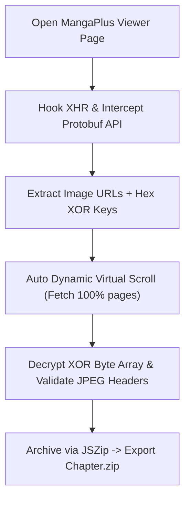

# 📚 MangaPlus Downloader & Decryptor (Auto ZIP)

<p align="center">
  
  <a href="./LICENSE"></a>
  
  
  <a href="https://www.buymeacoffee.com/toannh8" target="_blank"></a>
</p>

<p align="center">
  <b>A lightweight, high-performance open-source toolkit to automatically download, XOR-descramble, and archive full MangaPlus chapters into clean ZIP packages via 1-Click Browser Script or Scheduled CLI/Cron.</b>
</p>

<p align="center">
  <a href="https://www.buymeacoffee.com/toannh8" target="_blank">
    
  </a>
</p>

---

## 🌐 Languages / Ngôn ngữ
- **[🇻🇳 Tiếng Việt](./README.vn.md)**
- **[🇬🇧 English](./README.md)** *(Default)*

---

## 🌟 Overview
**MangaPlus Downloader & Decryptor** solves the challenge of saving encrypted web viewer chapters from [MANGA Plus by SHUEISHA](https://mangaplus.shueisha.co.jp/). It intercepts binary Protobuf streams, extracts XOR descrambling keys, dynamically scrolls past Virtual DOM bottlenecks, and outputs clean JPEG files inside structured `.zip` archives.

### ✨ Key Features
- ⚡ **1-Click Full Chapter Download**: Automatically bypasses Virtual DOM limitations with smooth virtual scrolling, decrypts all pages, and archives them into a single `.zip` file.
- 🔑 **Intelligent XOR Decryption**: Accurately detects original JPEG headers (`FF D8 FF`) and applies 16-byte hex XOR decryption keys only where scrambled.
- 📦 **No Chapter Length Limits**: Works seamlessly on standard chapters (15–20 pages) as well as supersized chapters (55+ pages like One Piece Chapter 1).
- 🔄 **SPA Navigation Resilient**: Automatically resets and recalibrates state when moving across chapters in MangaPlus's Single Page Application.
- ⏰ **CLI Automation & Cron Ready**: Includes standalone Python runners for headless downloading and scheduled automation.

---

## 🏗️ How It Works



---

## 🚀 Installation & Usage

### Method 1: Browser Userscript (Recommended)

1. **Install Userscript Manager**: Install [Tampermonkey](https://www.tampermonkey.net/) on Chrome, Firefox, Edge, or Brave.
2. **Add Script**: 
   - Open Tampermonkey Dashboard → Create a new script (`+`).
   - Copy the source code of [`mangaplus_downloader.user.js`](./mangaplus_downloader.user.js) and paste it.
   - Press **File → Save** (`Ctrl + S`).
3. **Download**:
   - Open any chapter on MangaPlus (e.g., [One Piece Chapter 1](https://mangaplus.shueisha.co.jp/viewer/1000486)).
   - Click the glowing aurora button at the bottom right: **`[v23.0] 🚀 Download Chapter (... pages - ZIP)`**.
   - The script will harvest, descramble, and download the full ZIP file automatically.

---

### Method 2: Python CLI & Cron Automation

#### Run Single Chapter via CLI:
```bash
python3 auto_runner.py "https://mangaplus.shueisha.co.jp/viewer/1029978"
```

#### Scheduled Automation with Cron:
1. Specify your target chapter/series URLs in the `WATCH_LIST` array inside [`auto_schedule.py`](./auto_schedule.py).
2. Open crontab:
   ```bash
   crontab -e
   ```
3. Add a weekly cron schedule (e.g., every Sunday at 23:00):
   ```cron
   0 23 * * 0 DISPLAY=:0 /usr/bin/python3 /path/to/mangaplus/auto_schedule.py >> /path/to/mangaplus/cron.log 2>&1
   ```

---

## ☕ Support & Donations
If this tool saves your time and helps your reading experience, consider supporting the developer with a coffee! ☕

<p align="center">
  <a href="https://www.buymeacoffee.com/toannh8" target="_blank">
    
  </a>
</p>

<div align="center">

| Method | Link / Details |
| :--- | :--- |
| ☕ **Buy Me a Coffee** | [buymeacoffee.com/toannh8](https://www.buymeacoffee.com/toannh8) |
| 💖 **PayPal** | [paypal.me/toannh8](https://paypal.me/toannh8) |

</div>

---

## 📄 License
This project is licensed under the **[MIT License](./LICENSE)**. You are free to use, modify, distribute, and integrate this software in your own projects with appropriate attribution.

---

## 📜 Disclaimer
This software is intended strictly for educational, interoperability research, and personal archiving purposes. All manga content, trademarks, characters, and copyrights belong exclusively to **SHUEISHA Inc.** and their respective authors. Please support the creators by purchasing official tankōbon volumes and subscribing to official services like MANGA Plus MAX.
