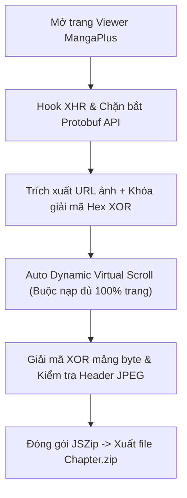

# 📚 MangaPlus Downloader & Decryptor (Tải trọn bộ ZIP)

<p align="center">
  
  <a href="./LICENSE"></a>
  
  
  <a href="https://www.buymeacoffee.com/toannh8" target="_blank"></a>
</p>

<p align="center">
  <b>Tự động tải trọn bộ chương truyện MangaPlus chất lượng cao nhất, tự giải mã ảnh XOR và đóng gói thành file ZIP chỉ với 1 click hoặc hoàn toàn tự động qua CLI/Cron.</b>
</p>

<p align="center">
  <a href="https://www.buymeacoffee.com/toannh8" target="_blank">
    
  </a>
</p>

---

## 🌐 Ngôn ngữ / Languages
- **[🇻🇳 Tiếng Việt](./README.vn.md)** *(Hiện tại)*
- **[🇬🇧 English](./README.md)**

---

## 🌟 Giới thiệu
**MangaPlus Downloader & Decryptor** là bộ công cụ mã nguồn mở giúp bạn giải quyết vấn đề tải và lưu trữ truyện từ trang đọc trực tuyến chính thức [MANGA Plus by SHUEISHA](https://mangaplus.shueisha.co.jp/). Công cụ tự động giải mã các byte bị xáo trộn, vượt qua cơ chế tải lười (Virtual DOM) và xuất ra file nén `.zip` chứa toàn bộ ảnh JPEG chất lượng gốc sắc nét.

### ✨ Tính năng nổi bật
- ⚡ **1-Click Tải Toàn Bộ Chương**: Tự động cuộn nạp ngầm (bypass Virtual DOM của MangaPlus), tự giải mã và xuất file `.zip`.
- 🔑 **Giải mã XOR thông minh**: Nhận diện ảnh JPEG gốc (`FF D8 FF`) và giải mã khóa hex XOR 16-byte cho các trang bị xáo trộn byte.
- 📦 **Không giới hạn độ dài chương**: Hỗ trợ đầy đủ từ các chương ngắn (15 trang) đến các chương siêu dài (55+ trang như One Piece Chap 1).
- 🔄 **Hỗ trợ SPA Navigation**: Tự động reset bộ đệm khi chuyển đổi qua lại giữa các Chapter mà không bị lẫn lộn số trang.
- ⏰ **Tự động hóa CLI & Lên lịch (Cron Job)**: Đi kèm script Python giúp tự động mở Chrome ngầm tải truyện và lưu thẳng vào thư mục định sẵn theo lịch hẹn.

---

## 🏗️ Cách thức hoạt động



---

## 🚀 Hướng dẫn cài đặt & Sử dụng

### Cách 1: Dùng trên Trình duyệt (Khuyên dùng - Nhanh nhất)

#### Bước 1: Cài đặt tiện ích Userscript
- Cài đặt tiện ích **Tampermonkey** hoặc **Violentmonkey** trên trình duyệt của bạn ([Chrome Web Store](https://chromewebstore.google.com/detail/tampermonkey/dhdgffkkebhmkfjojejmpbldmpobfkfo) / [Firefox Add-ons](https://addons.mozilla.org/firefox/addon/tampermonkey/)).

#### Bước 2: Thêm Script
1. Mở Dashboard của Tampermonkey → Chọn **Tạo script mới (+)**.
2. Sao chép toàn bộ nội dung file [`mangaplus_downloader.user.js`](./mangaplus_downloader.user.js) và dán vào.
3. Bấm **File → Save** (`Ctrl + S`).

#### Bước 3: Tải truyện
- Truy cập vào bất kỳ chương truyện nào trên MangaPlus (Ví dụ: [One Piece Chapter 1191](https://mangaplus.shueisha.co.jp/viewer/1029978)).
- Nút bấm lấp lánh **`[v23.0] 🚀 Download Chapter (... pages - ZIP)`** sẽ xuất hiện ở góc dưới bên phải màn hình.
- Bấm vào nút → Trình duyệt tự nạp, giải mã và tải ngay file `.zip` hoàn chỉnh về máy!

---

### Cách 2: Tự động hóa qua Python & Đặt lịch hẹn giờ (Cron)

Nếu bạn muốn hẹn giờ (ví dụ tối Chủ Nhật hàng tuần tự động tải chương mới nhất về máy):

#### 1. Chạy nhanh 1 chương từ Terminal:
```bash
python3 auto_runner.py "https://mangaplus.shueisha.co.jp/viewer/1029978"
```

#### 2. Đặt lịch Cron Job tải tự động:
1. Chỉnh sửa danh sách các bộ truyện bạn muốn theo dõi trong biến `WATCH_LIST` của file [`auto_schedule.py`](./auto_schedule.py).
2. Mở cấu hình cron trên Linux:
   ```bash
   crontab -e
   ```
3. Thêm dòng lệnh sau (Tự chạy vào 23:00 tối Chủ Nhật hàng tuần):
   ```cron
   0 23 * * 0 DISPLAY=:0 /usr/bin/python3 /path/to/mangaplus/auto_schedule.py >> /path/to/mangaplus/cron.log 2>&1
   ```

---

## ☕ Ủng hộ tác giả (Donate)
Nếu công cụ này giúp ích cho bạn và tiết kiệm thời gian, hãy cân nhắc mời tác giả một ly cà phê nhé! ❤️

<p align="center">
  <a href="https://www.buymeacoffee.com/toannh8" target="_blank">
    
  </a>
</p>

<div align="center">

| Phương thức | Thông tin chi tiết |
| :--- | :--- |
| 🏦 **Ngân hàng Techcombank** | *Số tài khoản:* `19028629696868` |
| 🪙 **Momo** | `0363629810` |
| ☕ **Buy Me a Coffee** | [buymeacoffee.com/toannh8](https://www.buymeacoffee.com/toannh8) |
| 💖 **PayPal** | [paypal.me/toannh8](https://paypal.me/toannh8) |

</div>

---

## 📄 Giấy phép bản quyền (License)
Dự án này được phát hành dưới giấy phép mã nguồn mở **[MIT License](./LICENSE)**. Bạn được toàn quyền tự do sử dụng, chỉnh sửa, phân phối và tích hợp vào các dự án cá nhân hoặc thương mại với điều kiện giữ nguyên thông tin bản quyền tác giả.

---

## 📜 Tuyên bố từ chối trách nhiệm (Disclaimer)
Phần mềm này được phát triển hoàn toàn vì mục đích học tập, nghiên cứu kỹ thuật khả năng tương tác (interoperability research) và lưu trữ cá nhân phi thương mại. Toàn bộ hình ảnh, nội dung truyện, nhân vật và bản quyền thuộc về **SHUEISHA Inc.** và các tác giả gốc. Vui lòng tôn trọng quyền tác giả bằng cách mua truyện bản quyền hoặc đăng ký dịch vụ chính thức MANGA Plus MAX.
